# Documentação — Rede Hospitalar Cuidar

## Sumário

- [Etapa 1 — Planejamento e Prototipação](#etapa-1--planejamento-e-prototipação)
- [Etapa 2 — Preparação do Ambiente em Nuvem e Virtualização Local](#etapa-2--preparação-do-ambiente-em-nuvem-e-virtualização-local)
- [Etapa 3 — Monitoramento Ativo da Infraestrutura de Servidores](#etapa-3--monitoramento-ativo-da-infraestrutura-de-servidores)
- [Etapa 4 — Segurança da Informação e Aplicação Back-End](#etapa-4--segurança-da-informação-e-aplicação-back-end)
- [Etapa 5 — Elaboração da Apresentação Final do Projeto](#etapa-5--elaboração-da-apresentação-final-do-projeto)

---

## Etapa 1 — Planejamento e Prototipação

### Gestão e Organização do Projeto

#### Definição do Tema e Cenário

O projeto foca na **Rede Hospitalar Cuidar**, uma instituição de saúde com matriz em Belo Horizonte e unidades remotas (Secretaria e três UPAs). O cenário exige alta disponibilidade e segmentação, dado o tráfego de dados sensíveis e a necessidade de comunicação ininterrupta para prontuários eletrônicos.

#### Responsabilidades e Colaboração

Para atender à gestão da comunicação e colaboração, o grupo utilizou ferramentas como Microsoft Teams e WhatsApp para alinhamento síncrono e assíncrono.

| Integrantes | Responsabilidade |
|---|---|
| Igor e Pedro | Planejamento de sub-redes (CIDR), NAT e lógica de serviços |
| Henrique | Implementação técnica e nomenclatura no Cisco Packet Tracer |
| Bernardo e Athos | Gestão de ativos, custos e planilhas de inventário |
| Fabrício | Redação técnica e revisão das normas de documentação |

#### Cronograma de Dedicação

| Data | Tarefa |
|---|---|
| 09/02 a 28/02 | Estudo dos microfundamentos e definição do cenário |
| 01/03 a 15/03 | Elaboração do inventário detalhado e cálculos de tráfego |
| 16/03 a 24/03 | Desenvolvimento do protótipo e testes de conectividade (Ping) |
| 25/03 a 28/03 | Ajustes de nomenclatura conforme feedback e entrega final |

### Arquitetura Lógica e Endereçamento

#### Divisão por CIDR e NAT

A rede utiliza o bloco privado `10.0.0.0/8`, segmentado para otimizar o domínio de broadcast e aumentar a segurança.

| Unidade | Faixa de Rede | Gateway | Servidor Principal |
|---|---|---|---|
| Matriz | 10.10.0.0/24 | 10.10.0.1 | SRV-BH-PRONTUARIO (10.10.0.10) |
| Secretaria | 10.20.0.0/24 | 10.20.0.1 | SRV-SEC-ADMIN (10.20.0.10) |
| UPA 1 | 10.30.0.0/24 | 10.30.0.1 | SRV-UPA1-LOCAL (10.30.0.10) |
| UPA 2 | 10.40.0.0/24 | 10.40.0.1 | SRV-UPA2-LOCAL (10.40.0.10) |
| UPA 3 | 10.50.0.0/24 | 10.50.0.1 | SRV-UPA3-LOCAL (10.50.0.10) |

**NAT (Network Address Translation):** Implementado nos roteadores de borda para mascarar as redes internas e permitir a saída WAN via IPs públicos simulados, protegendo a integridade da rede hospitalar.

### Justificativa de Recursos

#### Inventário de Equipamentos

O inventário foi organizado para equilibrar custo-benefício e robustez. Na Matriz, optamos por **Switches Cisco Catalyst 9200L** pela capacidade de empilhamento e **Firewalls FortiGate** para segurança NGFW. O uso de nobreaks senoidais da APC garante que os sistemas de prontuário não sofram quedas por oscilações elétricas.

#### Cálculo de Links e Tráfego

Conforme a planilha de cálculos, a Matriz possui um link de 152 Mbps, dimensionado para suportar o tráfego de videoconsultas e sincronização de banco de dados das filiais, que operam com links de 42,4 Mbps cada.

### Plano de Testes e Validação

Para validar o funcionamento, foram estabelecidos os seguintes testes no protótipo:

1. **Teste de Conectividade Interna:** Pings entre PCs da mesma sub-rede.
2. **Teste de Conectividade WAN:** Pings entre a UPA 3 e o SRV-BH-PRONTUARIO.
3. **Validação de Nomenclatura:** Conferência de que todos os dispositivos seguem o padrão *Unidade-Setor-ID*.

### Conclusão da Etapa 1

A Etapa 1 conclui-se com um protótipo funcional e uma documentação que justifica cada ativo escolhido. O projeto está pronto para a próxima fase, garantindo que a infraestrutura física e lógica atenda às demandas críticas da Rede Hospitalar Cuidar.

---

## Etapa 2 — Preparação do Ambiente em Nuvem e Virtualização Local

### Introdução

A Etapa 2 é marcada pelo mapeamento e implantação dos servidores em nuvem e *on-premise* para o devido atendimento do planejamento inicial. Nesta etapa, adaptações e definições de escopo foram realizadas para garantir a conformidade com o planejamento estabelecido na Etapa 1, bem como para atender às eventuais necessidades identificadas na fase anterior.

### Gestão e Organização da Etapa

#### Responsabilidades e Colaboração

Para a execução da Etapa 2, as responsabilidades foram distribuídas entre os membros do grupo de forma a aproveitar as competências individuais e garantir a entrega dentro do prazo estabelecido.

| Integrantes | Responsabilidade |
|---|---|
| Igor e Pedro | Configuração das instâncias EC2 na AWS e definição da arquitetura da VPC `rede-cuidar-vpc` |
| Henrique | Configuração do servidor Ubuntu no Oracle VirtualBox, incluindo definição de IP estático via `netplan` e integração com a rede local |
| Bernardo e Athos | Instalação e validação dos serviços no servidor Ubuntu (Apache2, MySQL, BIND9, DHCP e VSFTPD), além do acompanhamento de custos da instância AWS |
| Fabrício | Configuração do Active Directory, criação das Unidades Organizacionais, vinculação de GPO e redação técnica do documento |

### Ambiente em Nuvem — Amazon Web Services (AWS)

#### Escolha da Plataforma

O grupo optou pela utilização do **Amazon EC2** (Elastic Compute Cloud) como plataforma de nuvem, por ser um dos principais *players* de mercado, oferecendo alta disponibilidade, escalabilidade e um vasto ecossistema de serviços gerenciados adequados à infraestrutura hospitalar da Rede Cuidar.

#### Instâncias Configuradas

As instâncias foram criadas conforme o mapeamento de servidores definido na Etapa 1, seguindo as boas práticas de nomenclatura e endereçamento estabelecidas. O **Windows Server** foi implantado via instância EC2 para atuar como servidor de aplicação para publicação do back-end hospitalar.

| Campo | Informação |
|---|---|
| Nome da Instância | Rede Cuidar |
| ID da Instância | i-03c0d9df7ad6e2f96 |
| Tipo de Instância | t2.large |
| Sistema Operacional | Windows Server 2016 Datacenter |
| IP Público | 54.80.166.57 |
| IP Privado | 10.0.1.84 |
| Usuário de Acesso | Administrator |
| Método de Acesso | RDP (Área de Trabalho Remota) |
| Região | us-east-1 (Norte da Virgínia) |
| VPC | rede-cuidar-vpc (10.0.0.0/16) |
| Status | Executando |

#### Configuração de Segurança — Acesso Criptografado

O acesso às instâncias é realizado por meio de **SSH com autenticação por par de chaves pública/privada**, garantindo comunicação totalmente criptografada entre os administradores e os servidores em nuvem. Essa abordagem atende às boas práticas de segurança em infraestrutura de redes e assegura que nenhum acesso não autorizado seja possível sem a chave privada correspondente.

### Virtualização Local — Oracle VirtualBox

#### Configuração do Servidor On-Premise

Para o mapeamento dos serviços *on-premise*, foi utilizado o **Oracle VirtualBox** como plataforma de virtualização. O servidor local foi configurado com o sistema operacional **Ubuntu Server**, representando o servidor `SRV-BH-PRONTUARIO` da Matriz, conforme planejado na Etapa 1.

#### Configuração de Rede — IP Estático

O servidor virtual foi configurado com **endereço IP estático** via `netplan`, garantindo que o endereço de rede seja fixo e compatível com o plano de infraestrutura. A configuração foi aplicada no arquivo `/etc/netplan/50-cloud-init.yaml` com os seguintes parâmetros:

- **Interface:** `enp0s3`
- **Endereço IP:** `192.168.18.75/24`
- **Gateway:** `192.168.18.1`
- **DNS primário:** `8.8.8.8` (Google DNS)
- **DNS secundário:** `8.8.4.4` (Google DNS)
- **DHCP4:** Desabilitado

```yaml
network:
  version: 2
  ethernets:
    enp0s3:
      dhcp4: false
      addresses:
        - 192.168.18.75/24
      routes:
        - to: default
          via: 192.168.18.1
      nameservers:
        addresses:
          - 8.8.8.8
          - 8.8.4.4
```

#### Serviços Instalados

O servidor Ubuntu foi configurado com os seguintes serviços, atendendo às demandas de infraestrutura hospitalar mapeadas na Etapa 1:

| Serviço | Função | Porta Padrão |
|---|---|---|
| SSH | Acesso remoto seguro e criptografado ao servidor | 22 |
| Apache2 | Servidor Web para publicação de aplicações | 80/443 |
| MySQL | Banco de dados relacional para prontuários eletrônicos | 3306 |
| BIND9/named | Servidor DNS para resolução de nomes da rede interna | 53 |
| DHCP | Distribuição automática de endereços IP na rede local | 67 |
| VSFTPD | Servidor FTP para transferência segura de arquivos | 21 |

Todos os serviços foram instalados e configurados conforme as boas práticas de administração de sistemas Linux, garantindo que o servidor `SRV-BH-PRONTUARIO` esteja apto a atender as demandas da Matriz da Rede Hospitalar Cuidar.

### Evidências de Funcionamento

#### Servidor Ubuntu — IP Estático

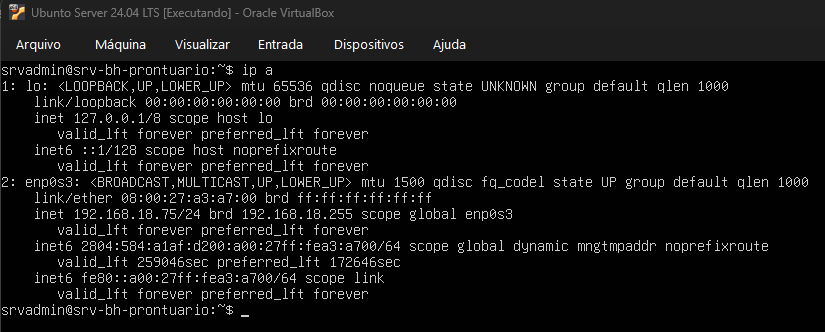

#### Servidor Ubuntu — Serviços Ativos

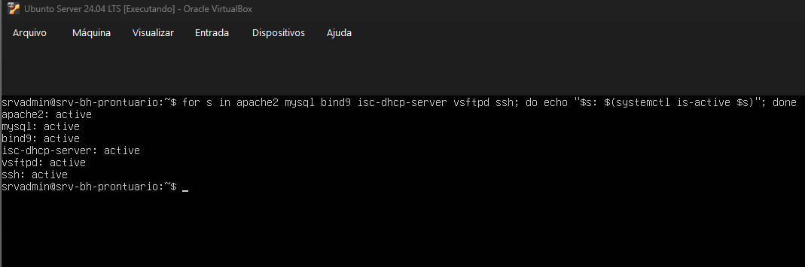

#### Instância AWS EC2

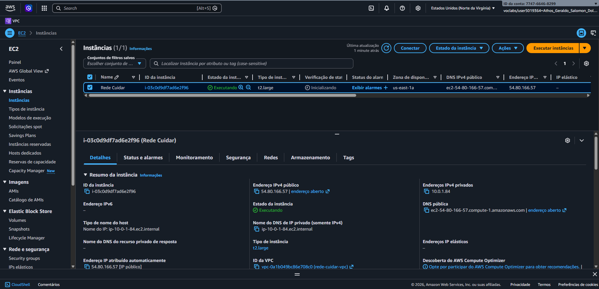

#### Windows Server — Servidor de Aplicação

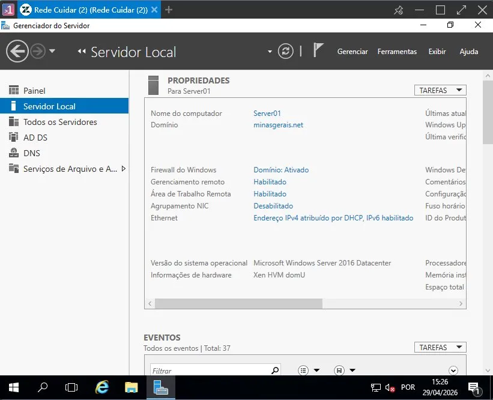

#### VPC — Rede Privada Virtual (AWS)

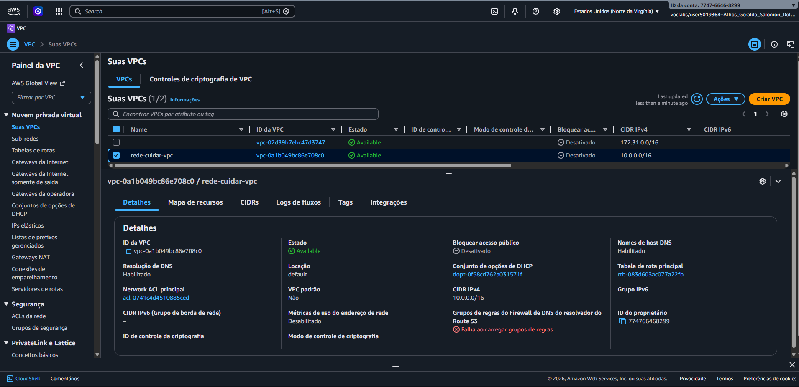

#### Active Directory — Estrutura do Domínio

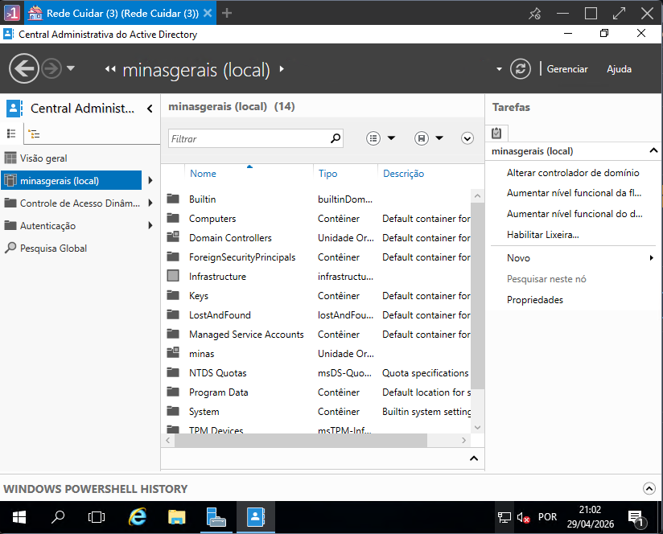

#### Active Directory — Unidades Organizacionais (OUs)

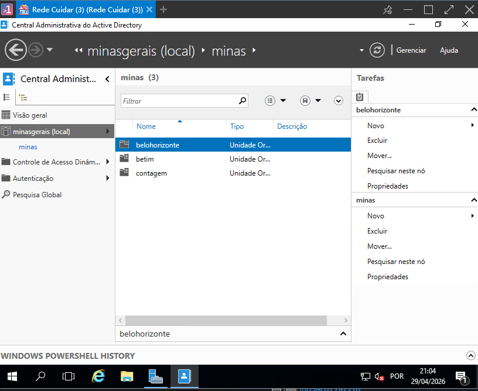

#### Política de Grupo (GPO)

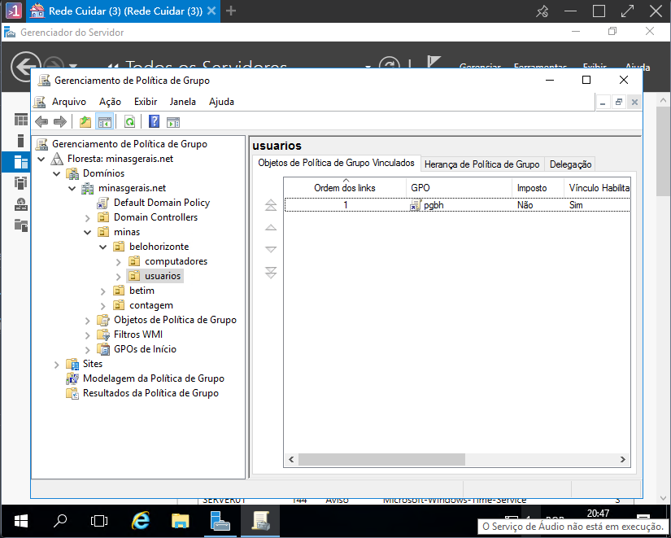

### Vídeo Demonstrativo

O vídeo demonstrativo da Etapa 2, exibindo o funcionamento dos ambientes configurados, está disponível no Microsoft Teams:

[Assistir vídeo demonstrativo](https://sgapucminasbr.sharepoint.com/sites/team_sga_2414_2026_1_7378102/_layouts/15/guestaccess.aspx?share=IQBUD9anyHlnSZGWIaAY6TzEAaYO6do7X8C4R6jARODEzeA&e=qDsxRR)

---

## Etapa 3 — Monitoramento Ativo da Infraestrutura de Servidores

### Introdução ao Monitoramento Centralizado

Para garantir os critérios de alta disponibilidade, integridade, identificação proativa de gargalos e comunicação ininterrupta exigidos pela **Rede Hospitalar Cuidar**, foi consolidada uma solução de monitoramento de ativos utilizando a ferramenta corporativa **Zabbix**.

Nesta etapa, a infraestrutura foi integrada de ponta a ponta, permitindo a coleta de dados de desempenho em tempo real por meio de agentes dedicados e protocolos de rede. A telemetria abrange o consumo de hardware (processamento, memória, E/S de disco) e volumetria de tráfego de dados, fornecendo visibilidade total sobre o ecossistema local e em nuvem.

### Gestão e Organização da Etapa

#### Responsabilidades e Colaboração

As atividades da Etapa 3 foram distribuídas entre os membros do grupo conforme as competências demonstradas nas etapas anteriores, garantindo continuidade e coesão na execução do projeto.

| Integrantes | Responsabilidade |
|---|---|
| Igor e Pedro | Instalação e configuração do Zabbix Appliance como plataforma central de monitoramento, incluindo definição de IP estático e acesso à interface web |
| Henrique | Configuração do protocolo SNMP nos servidores Ubuntu e Windows, correção das permissões de acesso no `snmpd.conf` e cadastro dos hosts no Zabbix |
| Bernardo e Athos | Criação do mapa de rede *Rede Hospitalar Cuidar* e configuração do dashboard personalizado com widgets de métricas e alertas |
| Fabrício | Análise e interpretação dos dados coletados pelo Zabbix, documentação dos resultados e redação técnica do capítulo |

### Topologia Lógica e Visões de Gerência

#### Mapa de Conectividade da Infraestrutura

O mapa de topologia estruturado no painel nativo do Zabbix (*All maps / Rede Hospitalar Cuidar*) ilustra as relações de conectividade e o fluxo saudável de comunicação entre os nós de gerência.

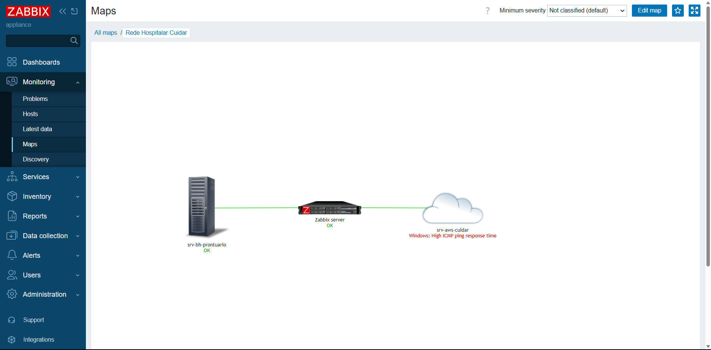

#### Painel Global de Operações (Dashboard)

O monitoramento centralizado conta com um painel de controle principal (*Dashboard*), que agrega os principais indicadores de desempenho do ecossistema hospitalar, facilitando a tomada de decisão em nível de suporte de infraestrutura.

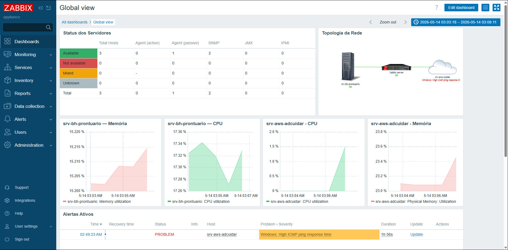

#### Inventário de Hosts e Status de Disponibilidade

Todos os hosts monitorados foram devidamente parametrizados e encontram-se operando sem a presença de problemas ou alertas ativos. A integração com o agente Zabbix garante a confiabilidade dos status apresentados.

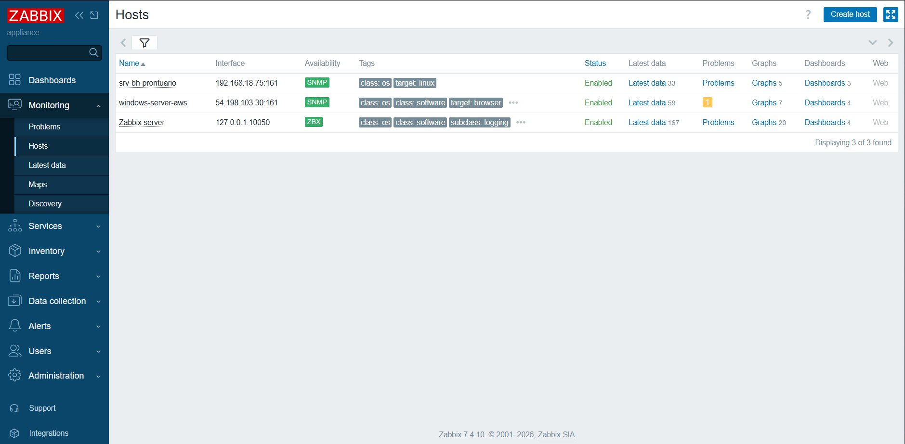

### Métricas de Performance — Servidor Local (srv-bh-prontuario)

O servidor local virtualizado, responsável pelo banco de dados de prontuários eletrônicos e serviços internos da Matriz em Belo Horizonte, teve seu comportamento monitorado e os gráficos gerados comprovam a conformidade do ambiente.

#### Utilização de CPU

O gráfico ilustra a carga de processamento da CPU do servidor Ubuntu. Os níveis operacionais mantêm-se baixos e estáveis, garantindo ampla margem para picos de requisições concorrentes.

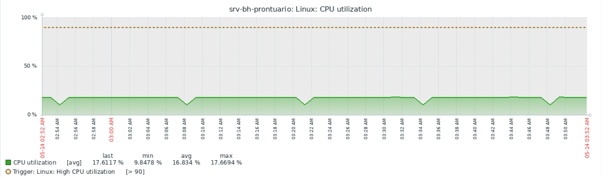

#### Utilização de Memória RAM

A telemetria de memória segmenta o espaço total alocado, identificando a fatia utilizada, disponível e em cache, atestando que a máquina não sofre com paginação excessiva em disco.

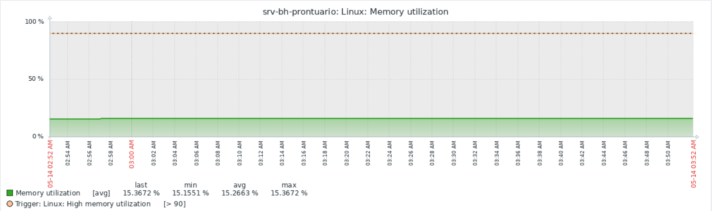

#### E/S de Disco (Leitura e Escrita)

Monitorar as operações de entrada e saída por segundo (IOPS) e taxa de transferência é crucial para o banco de dados MySQL. O gráfico confirma baixa latência de gravação física.

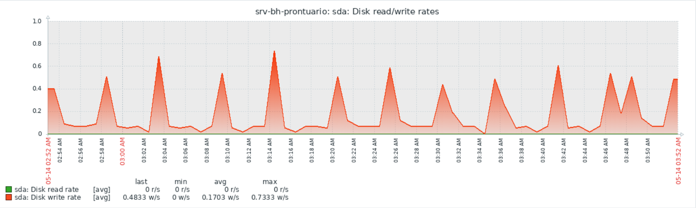

#### Tráfego de Rede

O volume de dados trafegado pela interface de rede (`enp0s3`) exibe o fluxo simétrico de dados de entrada (*In*) e saída (*Out*), atestando a integridade das respostas do Apache2 e DNS BIND9.

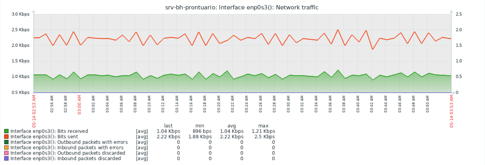

### Métricas de Performance — Servidor em Nuvem (srv-aws-cuidar)

A instância EC2 alocada na região Norte da Virgínia (`us-east-1`), que atua como controlador de domínio Active Directory e hospedagem do back-end hospitalar, teve suas métricas consolidadas.

#### Utilização de CPU

O monitoramento via contador do Windows Server mapeia as flutuações de uso do processador da instância `t2.large`. Os dados coletados apontam para um comportamento saudável e livre de gargalos lógicos de processamento.

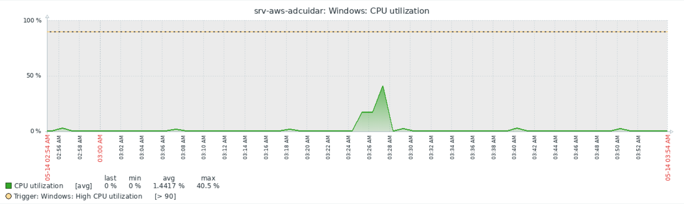

#### Utilização de Memória RAM

A telemetria exibe o consumo percentual e em bytes da memória do Windows Server. O gráfico assegura que o Active Directory e as políticas de grupo (GPO) aplicadas estão rodando de forma otimizada.

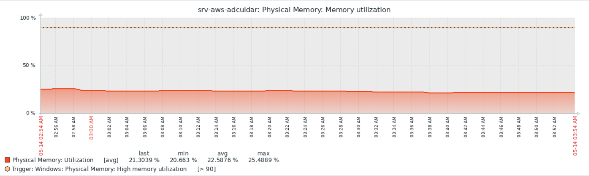

#### Tráfego de Rede na Instância Cloud

Os dados exibem o tráfego que cruza a placa de rede virtual conectada à VPC. A estabilidade dos gráficos comprova que, após a parametrização dos limiares (*thresholds*) de checagem do Zabbix, a latência geográfica devido à rota internacional foi devidamente mitigada, não interferindo na qualidade da coleta contínua de dados do agente.

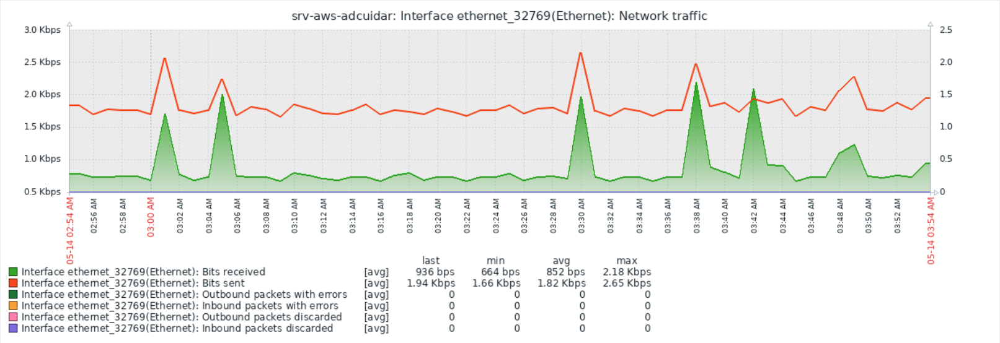

---

## Etapa 4 — Segurança da Informação e Aplicação Back-End

### Introdução

A Etapa 4 do projeto da Rede Hospitalar Cuidar teve como objetivo fortalecer os aspectos relacionados à segurança da informação da infraestrutura desenvolvida nas etapas anteriores. Além da elaboração da **Política de Segurança da Informação (PSI)**, foi desenvolvida uma aplicação web para gerenciamento de pacientes, bem como uma **cartilha de conscientização** voltada aos colaboradores da organização.

Adicionalmente, foram realizadas análises de vulnerabilidades do ambiente implantado, permitindo identificar riscos potenciais e propor mecanismos de mitigação alinhados às boas práticas recomendadas pelo OWASP Top 10 e às exigências da Lei Geral de Proteção de Dados (LGPD).

### Política de Segurança da Informação

Com o objetivo de estabelecer diretrizes formais para proteção dos ativos de informação da organização, foi elaborada a **Política de Segurança da Informação (PSI)** da Rede Hospitalar Cuidar. O documento foi desenvolvido com base nas recomendações da norma ABNT NBR ISO/IEC 27001 e contempla os princípios fundamentais de confidencialidade, integridade e disponibilidade das informações.

Os principais tópicos abordados pela política são:

- Controle de acesso e autenticação
- Segurança física e ambiental
- Proteção das redes e comunicações
- Gestão de incidentes de segurança
- Programas de treinamento e conscientização
- Avaliação contínua dos mecanismos de segurança
- Conformidade com requisitos legais e regulatórios

A PSI estabelece responsabilidades para todos os colaboradores da instituição e define procedimentos para garantir a proteção das informações sensíveis manipuladas pela organização.

### Cartilha de Boas Práticas de Acesso Seguro

Complementando a Política de Segurança da Informação, foi desenvolvida uma cartilha de boas práticas destinada aos colaboradores da Rede Hospitalar Cuidar. A cartilha foi elaborada em linguagem acessível, buscando conscientizar os usuários sobre os principais riscos de segurança presentes no ambiente corporativo.

Os assuntos abordados incluem:

- Criação e utilização segura de senhas
- Identificação de tentativas de phishing
- Engenharia social
- Cuidados no tratamento dos dados dos pacientes
- Procedimentos de reporte de incidentes
- Recomendações para acesso remoto seguro

A adoção dessas práticas contribui para reduzir riscos operacionais e fortalecer a cultura de segurança da informação dentro da organização.

### Aplicação Web para Gestão de Pacientes

Como parte das entregas desta etapa, foi desenvolvida uma aplicação web para gerenciamento de pacientes da Rede Hospitalar Cuidar. A solução foi implementada utilizando o framework **Flask** em conjunto com o banco de dados **MySQL**, permitindo a realização das operações fundamentais de um sistema CRUD (*Create, Read, Update and Delete*).

#### Funcionalidades Implementadas

- Cadastro de pacientes
- Consulta dos registros armazenados
- Atualização das informações cadastradas
- Exclusão de pacientes
- Associação dos pacientes às unidades de atendimento da rede

#### Tecnologias Utilizadas

| Componente | Tecnologia |
| --- | --- |
| Back-end | Flask 3.0 (Python) |
| Banco de Dados | MySQL 8.0 |
| Conector | mysql-connector-python |
| Front-end | HTML5 + CSS3 (Jinja2) |
| Servidor | Ubuntu Server (192.168.18.75) |

#### Estrutura do Projeto

```
crud-cuidar/
├── app.py               # Rotas CRUD (Flask)
├── setup_db.sql         # Script de criação do banco
├── requirements.txt     # Dependências Python
└── templates/
    ├── base.html        # Layout base
    ├── index.html       # Listagem de pacientes
    ├── cadastrar.html   # Formulário de cadastro
    └── editar.html      # Formulário de edição
```

#### Evidências da Aplicação

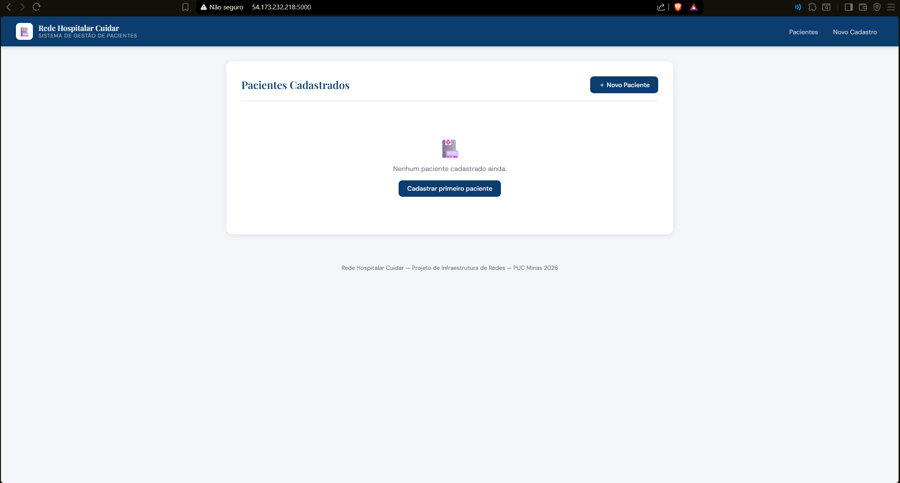

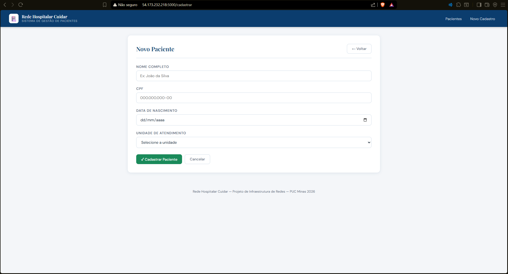

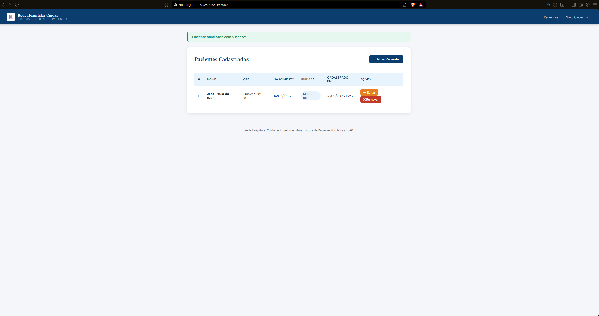

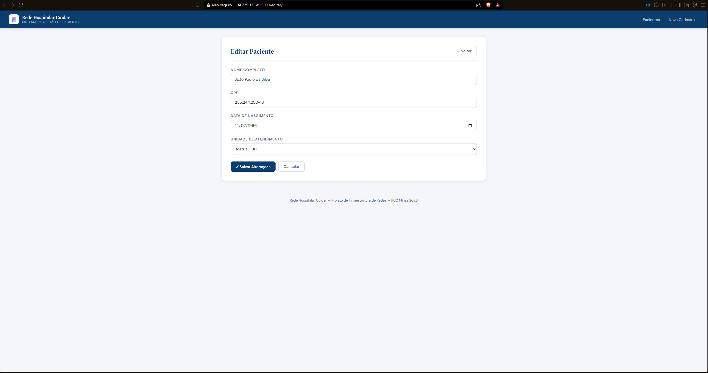

#### Implantação

A aplicação foi disponibilizada tanto no ambiente local (servidor Ubuntu `192.168.18.75`, porta `5000`) quanto no ambiente em nuvem, permitindo validar a integração entre os serviços de infraestrutura implementados ao longo do projeto. O banco de dados `hospital_cuidar` roda no mesmo servidor, garantindo baixa latência nas operações.

### Análise de Vulnerabilidades

Com base na infraestrutura implantada para hospedar a aplicação da Rede Hospitalar Cuidar, foram identificadas três vulnerabilidades classificadas segundo o **OWASP Top 10 (2021)**.

#### Injeção de SQL (SQL Injection)

A aplicação recebe informações por meio dos formulários HTML e realiza operações sobre o banco de dados MySQL. Caso consultas parametrizadas não sejam utilizadas adequadamente em todas as rotas da aplicação, existe a possibilidade de exploração por meio de ataques de SQL Injection.

**Mitigação:** Utilização exclusiva de consultas parametrizadas (*prepared statements*) e aplicação do princípio do menor privilégio aos usuários do banco de dados.

#### Ausência de Criptografia das Comunicações

A aplicação encontra-se acessível por meio do protocolo HTTP, sem utilização de TLS. Essa característica permite que os dados trafeguem em texto puro, possibilitando ataques de interceptação e comprometendo a confidencialidade das informações dos pacientes.

**Mitigação:** Utilização de um proxy reverso Nginx associado a certificados digitais TLS, permitindo a utilização do protocolo HTTPS.

#### Ausência de Controle de Acesso e Autenticação

Foi identificado que a aplicação não implementa mecanismos de autenticação e autorização. Dessa forma, qualquer usuário que possua acesso ao endereço da aplicação pode visualizar, alterar ou excluir registros de pacientes.

**Mitigação:** Implementação de autenticação baseada em sessões utilizando Flask-Login, associada a um modelo RBAC (*Role Based Access Control*), permitindo diferentes níveis de permissão conforme o perfil do usuário.

### Divisão das Atividades da Etapa

| Integrantes | Responsabilidade |
|---|---|
| Athos | PSI, desenvolvimento da aplicação web Flask, configuração do MySQL e implantação local/nuvem |
| Pedro | PSI, revisão da documentação e suporte ao desenvolvimento |
| Bernardo | Elaboração e design da cartilha de boas práticas de acesso seguro |
| Henrique | Elaboração e revisão da cartilha de boas práticas |
| Igor | Redação e estruturação do relatório técnico, documentação do ambiente e análise de vulnerabilidades |
| Fabrício | Redação e revisão do relatório técnico e documentação das vulnerabilidades |

### Conclusão da Etapa 4

A Etapa 4 permitiu consolidar os mecanismos de segurança da informação da Rede Hospitalar Cuidar, integrando aspectos técnicos e organizacionais. Além da elaboração da Política de Segurança da Informação e da cartilha de conscientização, foi desenvolvida e implantada uma aplicação web para gerenciamento de pacientes, demonstrando a integração entre infraestrutura, banco de dados e desenvolvimento de software.

A análise das vulnerabilidades possibilitou identificar pontos de melhoria e propor mecanismos de mitigação alinhados às recomendações do OWASP Top 10 e às exigências da LGPD, contribuindo para aumentar a maturidade de segurança da solução implementada.

---

## Documentos

| Documento | Descrição |
|---|---|
| [📄 Política de Segurança da Informação — PSI](PSI_Rede_Hospitalar_Cuidar.pdf) | PSI v1.0 (Junho/2026). Diretrizes, responsabilidades e controles para proteção dos ativos de informação, em conformidade com LGPD, ISO/IEC 27001 e Resolução CFM nº 1.821/2007. Abrange: tríade da segurança, gerenciamento de acesso (AD, senhas 12+ chars, MFA, RBAC), segurança de redes (segmentação /24, firewalls, Zabbix), resposta a incidentes (30 min alta severidade), conformidade legal, gestão de vulnerabilidades (patches críticos em 72h) e responsabilidades. |
| [📄 Cartilha de Boas Práticas de Acesso Seguro](Cartilha_Boas_Praticas_Rede_Hospitalar_Cuidar.pdf) | Cartilha de conscientização para colaboradores sobre segurança da informação: senhas seguras, phishing, engenharia social, proteção de dados de pacientes e acesso remoto seguro. |
| [📄 Apresentação Final (Slides)](Apresentação_Rede_Hospitalar_Cuidar.pdf) | Slides da apresentação final do projeto, desenvolvidos em Overleaf/Beamer, cobrindo todas as 5 etapas do projeto. |
| [📄 Documento Final do Projeto](Entrega_Final_Eixo_5_Rede_Hospitalar_Cuidar.pdf) | Documento completo consolidando todo o conteúdo do projeto, incluindo planejamento, implementação, monitoramento, segurança e conclusões. |
| [📄 Relatório Técnico](Relatorio_Tecnico_Rede_Hospitalar_Cuidar.pdf) | Relatório técnico original do projeto. |

---

## Etapa 5 — Elaboração da Apresentação Final do Projeto

### Objetivo da Etapa

A quinta etapa do projeto teve como objetivo consolidar os resultados obtidos ao longo do desenvolvimento da infraestrutura da Rede Hospitalar Cuidar em uma apresentação final, permitindo a exposição organizada das soluções implementadas e dos resultados alcançados pelo grupo.

A apresentação foi desenvolvida utilizando a plataforma **Overleaf**, por meio da classe *Beamer* em LaTeX, possibilitando a elaboração colaborativa do material e a padronização visual dos slides.

### Organização e Colaboração da Equipe

Seguindo a metodologia de trabalho adotada nas etapas anteriores, todos os integrantes participaram ativamente da construção da apresentação, sendo responsáveis pela elaboração dos slides referentes às atividades que desenvolveram durante o projeto.

| Integrantes | Responsabilidade |
|---|---|
| Igor e Pedro | Slides de planejamento da infraestrutura e serviços em nuvem |
| Henrique | Conteúdos de virtualização, Active Directory e configuração dos servidores |
| Bernardo e Athos | Organização visual, inserção das evidências e revisão do material |
| Fabrício | Revisão textual, padronização da documentação e organização lógica |

### Estrutura da Apresentação

A apresentação foi organizada de forma a representar cronologicamente as etapas do projeto:

1. Planejamento da infraestrutura da Rede Hospitalar Cuidar
2. Implantação do ambiente em nuvem e virtualização local
3. Configuração dos serviços e do Active Directory
4. Monitoramento da infraestrutura por meio do Zabbix
5. Aplicação das práticas de segurança da informação
6. Demonstração da aplicação CRUD desenvolvida para gerenciamento de pacientes
7. Principais vulnerabilidades identificadas e recomendações de mitigação
8. Conclusões gerais do projeto

### Resultados Obtidos

A evolução da apresentação permitiu consolidar todos os conhecimentos desenvolvidos ao longo do semestre, reunindo em um único material as evidências, resultados e soluções implementadas para a Rede Hospitalar Cuidar. Além disso, a atividade proporcionou maior integração entre os membros da equipe, contribuindo para a organização do conteúdo e para a preparação da apresentação final do projeto perante a disciplina.

---
